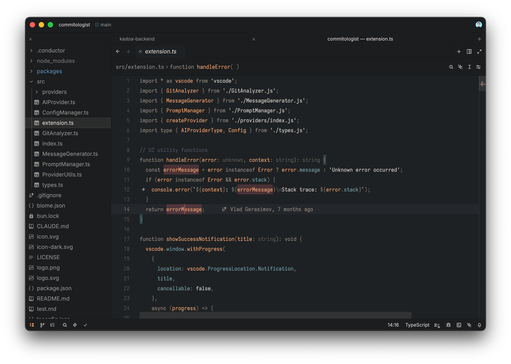
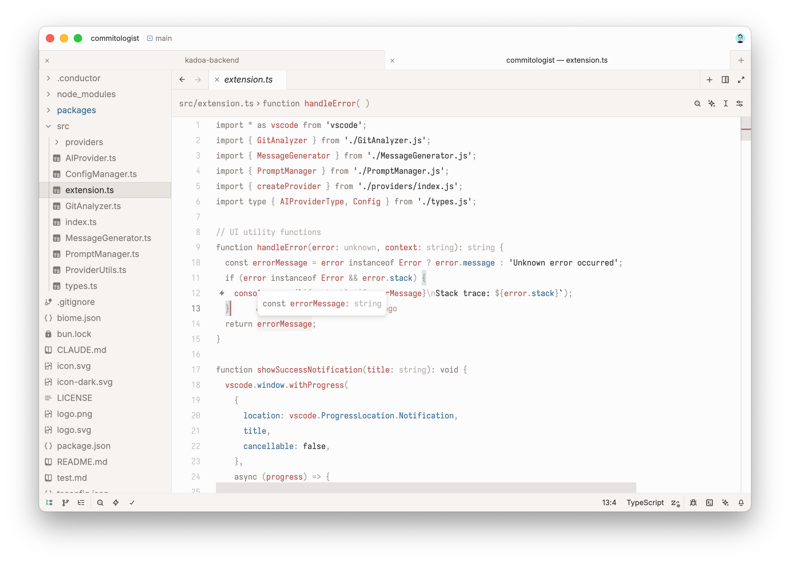

# Tiniri for Zed

Calm and cozy color themes with warm, desaturated colors.

## Install

While the extension is [pending review](https://github.com/zed-industries/extensions/pull/4757), install manually:

1. Copy `themes/tiniri.json` to `~/.config/zed/themes/`
2. Open Zed, `Cmd+K Cmd+T` to select theme
